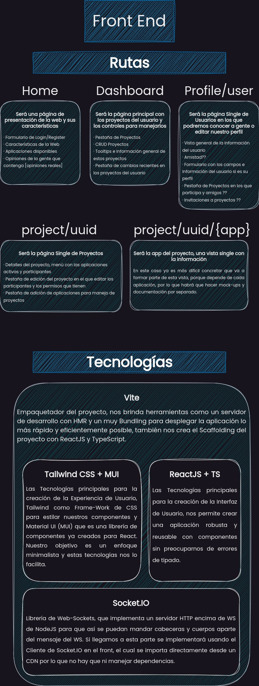

# Front-End

Aquí estará la documentación del proyecto de Front-End del proyecto integrado en formato `Markdown`.

## Resumen de la temática de la aplicación

La idea que hemos tenido es, juntar muchas ideas ya establecidas por aplicaciones web como **Jira**, **Google Docs** y **Trello** y crear una aplicación de organización de proyectos.

Esta aplicación tendrá usuarios y estos usuarios podrán seguir a otros e invitarlos a sus proyectos. Estos proyectos constaran de diferentes aplicaciones, las cuales se podrán añadir por el Administrador del Proyecto, un ejemplo de aplicacion puede ser el tablero Kanban o una tabla de planificación de sprint ágil.

Por lo que tenemos una aplicación que permite organizar proyectos de manera dinámica y que te permite añadir o eliminar diferentes servicios dependiendo de las necesidades del equipo del proyecto.

Aparte de esto, tenemos pensado expandir las capacidades de la aplicación para permitir la comunicación en tiempo real de diferentes componentes, para así poder crear una aplicación de brainstorming en tiempo real en el que se puedan ver los cambios de los participantes como el Google Docs y chats en tiempo real para que los integrantes de los grupos puedan comunicarse los unos con los otros en tiempo real recibiendo notificaciones.

> Este proyecto está pensado también como idea de negocio, por lo que podríamos contar con diferentes planes, con un precio por desarrollador o un plan de empresa, que les de acceso a diferentes aplicaciones más complicadas para que así todo el mundo tenga acceso de manera gratuita pero las funciones más complicadas y que generen un alto rendimiento en una empresa sean remuneradas.

## Esquema de las vistas y tecnologías 

Hemos realizado un esquema con las vistas que va a tener la aplicación, lo que va a contener más o menos cada una y las tecnologías que vamos a utilizar cada uno.

 Click para ver la imagen 

## Aplicación de Escritorio

Aun siendo este el repositorio de Front-End, la tecnología que vamos a utilizar para llevar a cabo la aplicación de escritorio es Tauri, que funciona instalando dependencias con NPM, sin necesidad de hacer nada más, por lo que realmente el repositorio del Escritorio solo nos servirá para hacer los binarios.

Tauri funciona haciendo uso de las librerías Web disponibles en todos los sistemas operativos, esto hace que sea tan fácil como crear una ventana usando estas librerías y correr la app dentro de ese `navegador`. Está escrito en `Rust` y utiliza las librería WRY [WebView Rendering Library](https://github.com/tauri-apps/wry) para crear una capa de abstración que determina que librería de WebView usar según el sistema operativo y como usarla, y también utiliza TAO [Window Creation Library](https://github.com/tauri-apps/tao) que permite crear ventanas en los diferentes sistemas operativos.

Todo esto se integra en el proyecto, por lo que realmente no hay que crear un proyecto para la aplicación de escritorio si no que hay que integrarlo en el Front-End de nuestra aplicación.

### Pipeline CI/CD para automatizar la compilación y despliegue de la aplicación

Hemos decidido crear una Pipeline de CI/CD, que testee nuestro proyecto, compruebe si la aplicación de escritorio funciona como debería y cree los binarios desplegándolos en su repositorio, todo esto cada vez que se efectúe un cambio en la rama Main, ya que vamos a seguir Git Flow porque es lo que hemos aprendido en la empresa y queremos seguir expandiendo sobre ese método de trabajo, por lo que crearemos una rama develop en la que estará el trabajo más reciente, y de esta rama iremos sacando ramas por cada tarea que vayamos realizando, una vez acabemos haremos un pull request a la rama develop y entre nosotros testearemos el código y haremos revisiones y aceptaremos la pull request. Una vez tengamos un release que hacer subiremos el repo a la rama main donde se ejecutará el workflow de Github Actions con el que se testeará, compilará y desplegará el binario de las diferentes plataformas al repositorio de Escritorio.

## Gitflow 

En este gráfico realizado con [Mermaid](https://mermaid.js.org/syntax/gitgraph.html) podemos ver el flujo de trabajo que nos aporta la convención de Git Flow, una vez creado todo el proyecto en la rama main, creamos una rama de desarrollo, en la que estará todos los cambios `inestables` y sobre la que iremos desarrollando, crearemos ramas `feature` en las que iremos añadiendo diferentes funciones al programa.

Las ramas feature tendrán que mergearse con la rama develop, por lo que haremos pull request a esa rama y nos haremos `Revisiones de Código` entre nostros y nos aceptaremos o denegaremos las PR, tras esto, mergearemos las ramas para que los cambios consten en la rama develop.

Una vez tengamos un `Release candidate` cuando se le hagan las pruebas pertinentes y comprobemos que funciona todo, se mergeará a la rama main, en la que habrá un `Flujo de trabajo` de Github Actions que ejecutará las siguientes tareas:

    1- Integrará el código del proyecto y comprobará que no hay fallos de Bundling (Continuous Integration).
    2- Desplegará la aplicación web de la manera que hayamos estipulado, y compilará y distribuirá los
    diferentes ejecutables de la aplicación de escritorio.

De esta manera habremos automatizado tanto la integración de la aplicación web como el despliegue de esta y de los binarios de la aplicación de escritorio.

# Manejo del Estado en react

Para manejar el estado hemos utilizado la API Context de React, esto nos permite definir un contexto alrededor de nuestra app que contiene las variables más importantes y como se manejan y cambia conforme el usuario interactúa con ellas.

Hemos creado custom hooks con los que reutilizar la lógica detrás de todas las operaciones con el contexto, por lo que nos va que dar el código lo más limpio y reducido posible.

### Esquema con la estructura de hooks
